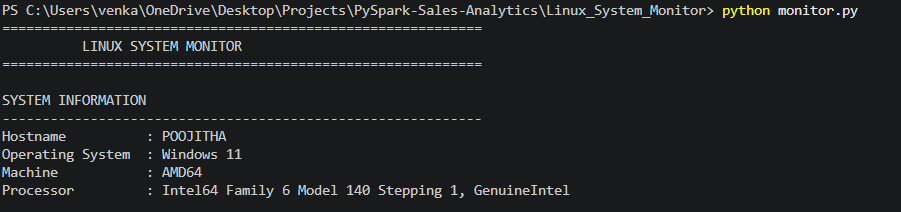
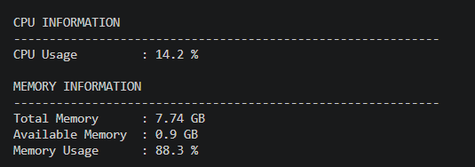
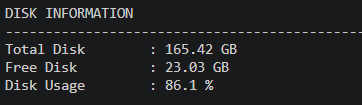
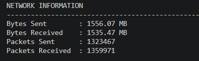
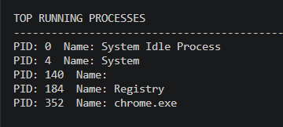

#  Linux System Monitor

##  Overview
Linux System Monitor is a Python-based system monitoring tool that tracks real-time system performance metrics such as CPU usage, memory usage, disk usage, network activity, and running processes.

This project demonstrates system-level monitoring, automation, and logging concepts used in DevOps environments.

---

##  Features

-  CPU Usage Monitoring
-  Memory Usage Tracking
-  Disk Usage Analysis
-  Network Statistics Monitoring
-  Running Process Monitoring
-  System Uptime Tracking
-  Alert System for high resource usage
-  Automatic Logging system
-  Bash script automation support
-  Cross-platform support (Windows + WSL Linux)

---

##  Tech Stack

- Python 3
- psutil library
- Bash scripting
- Git & GitHub
- WSL (Ubuntu on Windows)

---

##  Project Structure

```
Linux_System_Monitor/
│
├── monitor.py              # Main monitoring script
├── monitor.sh              # Bash automation script
├── logs/                   # System logs storage
├── screenshots/            # Output screenshots
├── .gitignore
├── .dockerignore
├── requirements.txt
└── README.md
```

---

##  Installation & Setup

### 1️ Clone Repository
```bash
git clone https://github.com/Poojitha363/Linux-System-Monitor.git
cd Linux-System-Monitor
```

### 2️ Install Dependencies
```bash
pip install psutil
```

---

##  How to Run

### Run Python Script
```bash
python monitor.py
```

### Run Bash Script (WSL/Linux)
```bash
bash monitor.sh
```

---

##  Sample Output

- CPU usage percentage
- Memory utilization
- Disk usage statistics
- Network sent/received data
- Running processes list
- System uptime
- Logs saved in `logs/` directory

---

##  Key Highlights

✔ Real-time system monitoring  
✔ DevOps-style logging system  
✔ Automated Bash scripting  
✔ Cross-platform (Windows + WSL Linux) support  
✔ Lightweight Python-based monitoring tool  
✔ Beginner-friendly system observability project  

---

##  Screenshots

###  System Monitoring Output


###  CPU & Memory Usage


###  Disk Usage Analysis


###  Network Monitoring


###  Process Monitoring


---

##  Note

- WSL (Windows Subsystem for Linux) is used for Linux environment simulation
- Docker containerization is planned as a future enhancement

---

##  Author

**Poojitha Indirala**  
- GitHub: https://github.com/Poojitha363  
- LinkedIn: https://linkedin.com/in/poojitha-indirala-85331b336  

---

##  Future Improvements

- Docker containerization
- Real-time dashboard (Streamlit / Grafana)
- Email/SMS alert system
- Cloud monitoring integration (AWS)
- Kubernetes deployment support